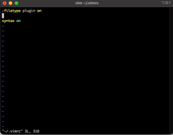
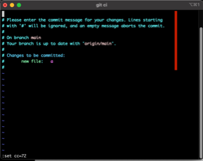

# Tools

Enabling the plugin into vim:

[]

```
Create/add to ~/.vimrc:
 
:filetype plugin on
 
syntax on
```

Setting column limit:

[]

Breaking lines online:

https://www.gillmeister-software.com/online-tools/text/add-line-breaks_change-line-length.aspx


Git aliases:

https://kapeli.com/cheat_sheets/Oh-My-Zsh_Git.docset/Contents/Resources/Documents/index